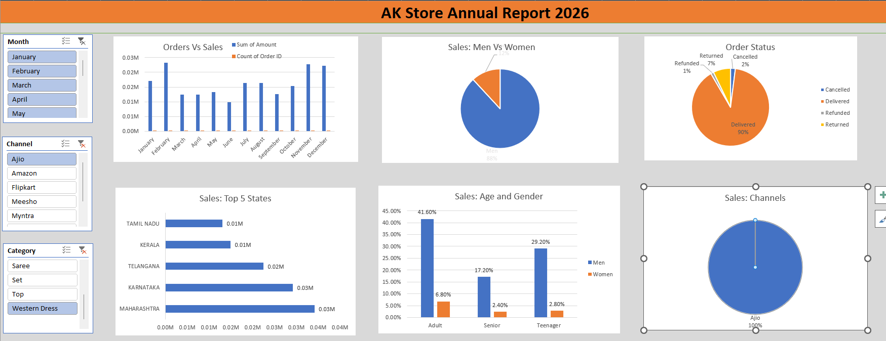

# AK Store Annual Report 2026 - Excel Dashboard Project

## Project Overview
This project is an Excel-based interactive dashboard created for analyzing annual sales data of AK Store for the year 2026.

The dashboard helps visualize:
- Orders vs Sales
- Men vs Women Sales
- Order Status
- Top 5 States
- Age and Gender Analysis
- Sales Channels

## Tools Used
- Microsoft Excel
- Pivot Tables
- Pivot Charts
- Slicers
- Data Cleaning
- Dashboard Design

## Features
- Interactive slicers
- Dynamic charts
- Sales analysis by gender
- State-wise revenue analysis
- Channel performance tracking

## Sheets Included
1. Steps
2. Ak_store
3. Orders vs Sales
4. Men vs Women
5. Order_Status
6. Top 5 states
7. Age and Gender
8. Channels
9. Store_Report
10. Dashboard

## Dashboard Preview

## Dataset
The dataset contains:
- Order ID
- Customer Details
- Gender
- Age
- State
- Channel
- Product Category
- Revenue
- Order Status

## Learning Outcome
Through this project, I learned:
- Data cleaning in Excel
- Creating Pivot Tables
- Creating Pivot Charts
- Building interactive dashboards
- Business data analysis

## Author
Ansar KP
